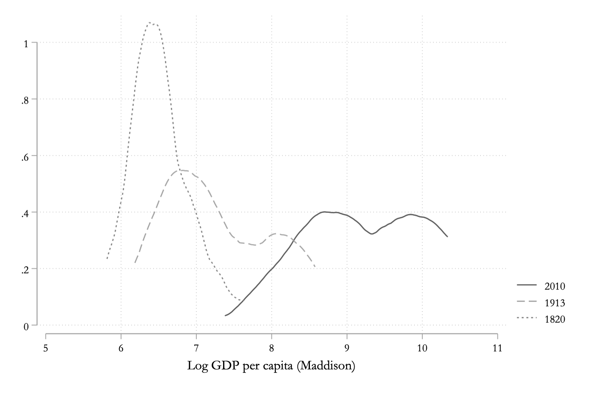
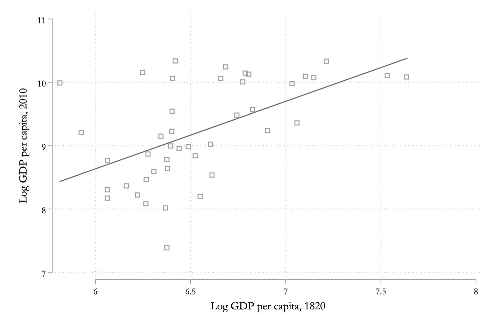
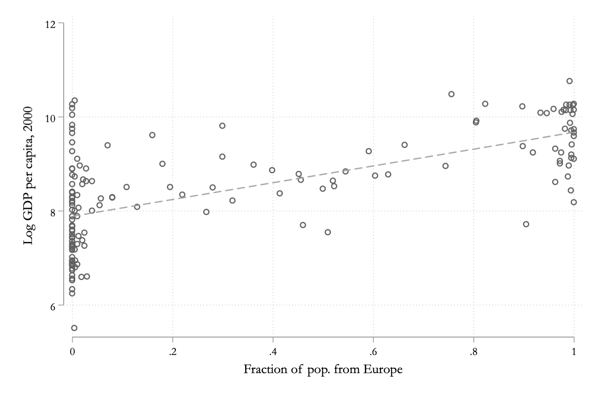
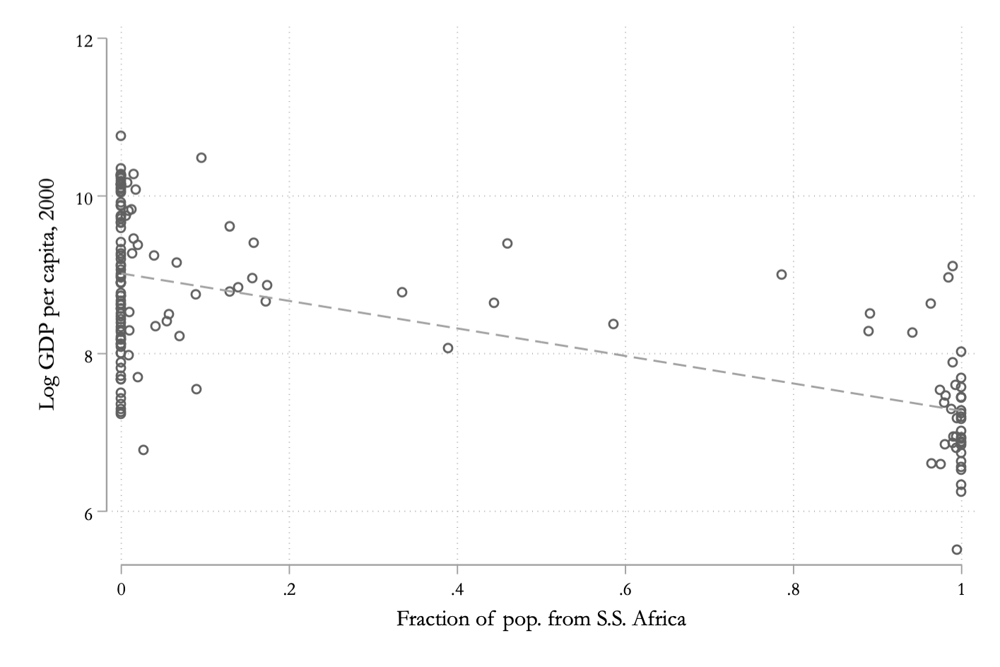
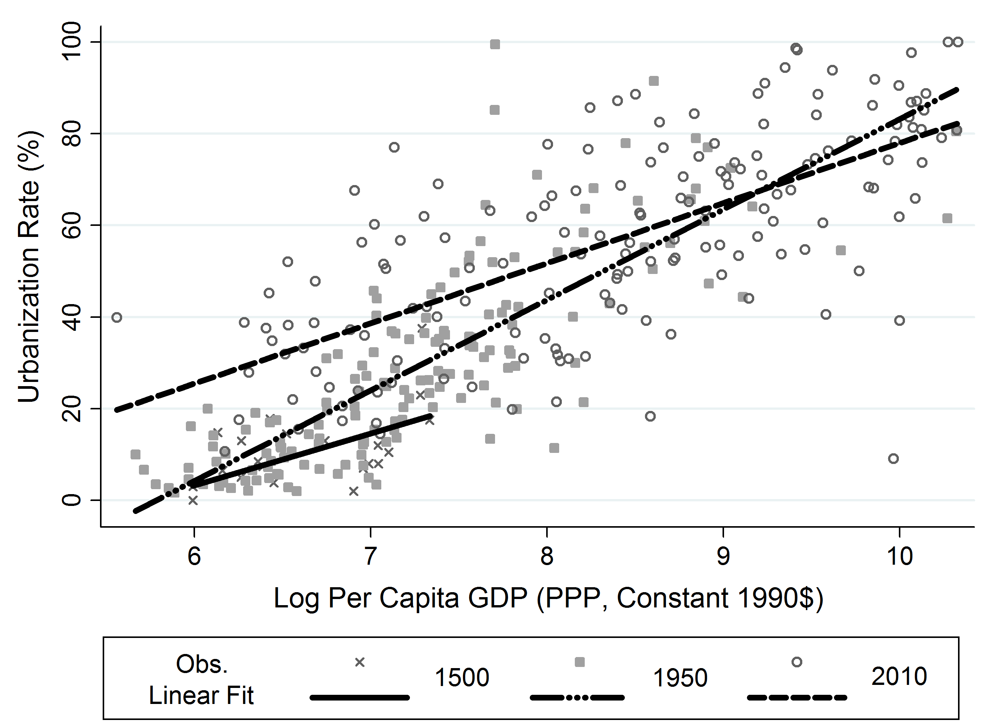
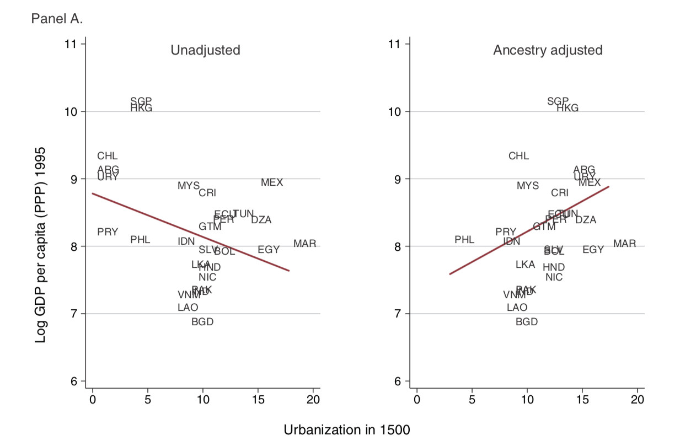
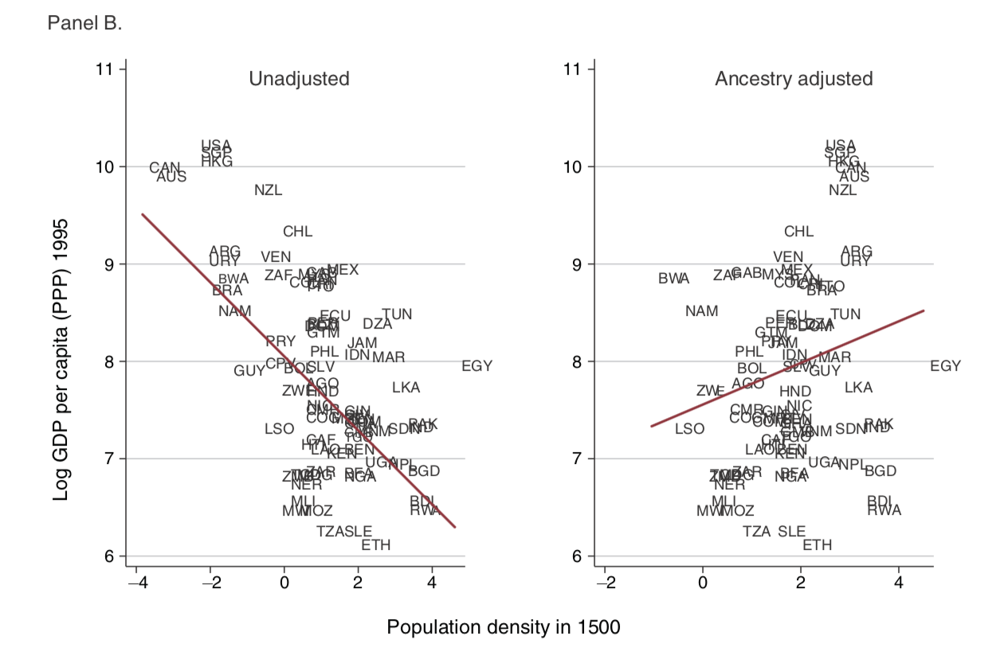

Look at me, two posts in less than two weeks! I'm back with the second part of the series I'm writing on the deep roots of comparative development. Part 1 is here, and gave an overview of this literature. Here I'm gonna tackle some of the basic evidence on crude living standard differences that I think motivates studying those deep roots in the first place.

### Modern living standards
The variance in measures like GDP per capita across countries today is well known. This variance is the source of the question "Why are some places rich and some places poor?". To get some sense of this variation, here's a density plot of log real GDP per capita across countries from Angus Maddison's dataset. 

The line from 2010 ranges from about 6 (400-ish real dollars) to 10 (22,000-ish real dollars), or a factor of about 55. That takes into account some extremes, but the 90th/10th ratio is around 22, and even the 75th/25th ratio is still around 4. That is the scope of what we are trying to explain. How is it that some places produce four, or twenty, or fifty times as much as others? 

If you look backward in time, say at 1913 or 1820, then you still see variance, but it is lower. In 1913 the distribution spans almost 3 log points (6 to 9), meaning a ratio of about 20 between top and bottom countries. The 90/10 ratio is about 6 in 1913. Going back to 1820, you still see variation, although the span is only about 1 log point (6 to 7), for a ratio of about 2.7, and a 90/10 ratio of about 3. 

One issue with the first figure is that it may be skewed a little by the fact that more and more countries are included as the year becomes more recent. The second figure here shows the same kind of plots using only the same 48 countries that appear in the 1820 data. What that does is lop off the bottom end of the distribution in 2010. The 48 countries that Maddison calculated GDP per capita for in 1820 are all somewhat well off in 2010, although not universally so. 

What can we learn from these figures? First, we can see that the very wide distribution of GDP per capita today (2010) was much narrower about 200 years ago, which was right around the time the Industrial Revolution hit northwest Europe. (NB: Arguing about the timing and scope of the IR is *not* what I'm interested in here - 1820 is correct +/- 40 years either way). So with the onset of industrialization a major divergence took place that exaggerated the distribution of GDP per capita. 

What isn't obvious from the figures is whether it was the *same* countries leading, and the same countries lagging, at each point in time. It could well be that the leading countries in 1820 got overtaken by poor countries in 1820, who are now rich. But that doesn't appear to be the case. Rather than look at the density plots, the next figure shows log GDP per capita in 2010 against log GDP per capita in 1820 for the 48 countries that have data in both years. There is a clear positive relationship, meaning that the countries at the top end of the distribution in 1820 were still around the top of the distribution in 2010.

I did not label these points with country names on purpose, because that way lies niggling arguments about specific cases, and for the time being that is not what I want to get into. Suffice it to say that there is evidence that leaders of 2010 were also likely to be leaders in 1820, although not universally. 

As an aside, a perfectly valid question here is whether we should buy Maddison's numbers for 1820. It could well be that Maddison decided *first* that there *must* be a positive relationship, and then backed out his 1820 numbers to make sure the figure ended up right. I don't think he explicitly did this, but it could well be that his implicit ideas about relative incomes based on his impression of history were leading him one way or another. But I think there is sufficient data from wage series accumulating to support the idea that Maddison's numbers are *roughly* right in how they order countries in 1820. 

A second thing to learn from these figures - or at least the first one - is that the bottom end of the distribution is about the *same* in 2010 as it was in 1820. The poorest places in both time periods have real GDP per capita of around $400. It's not just that the top end saw faster growth from 1820 to 2010 than the bottom end, it's that the bottom end doesn't appear to have grown *at all*. 

Perhaps this is trying to be too subtle, but I think this leads to a distinction in the following questions. "Why did poor countries today grow slower than rich countries from 1820 to 2010?" is not the same thing as "Why did poor countries today not grow at all?". The latter question is more relevant to this deep roots literature. It is about what conditions led some countries to (eventually) make the jump to sustained growth, and what conditions have prevented (so far) others from making that same jump. I think the deep roots literature takes as a given that once you do make the jump, that there are strong convergence forces at work that will carry you to the neighborhood of rich countries, a la South Korea or Japan. 

So perhaps to explain growth *today*, we need to reach back to 1820 or earlier and identify what created the variation in the first place. 

### Rich populations and poor populations
The data in the prior figures is all based on country borders. And if you think about which ones are rich and which ones are poor, there are some regularities based on the origins of the people in those countries. Europe, and especially western Europe, is relatively rich. But so are places like the U.S., Canada, New Zealand, and Australia that are referred to as "Neo-Europes" because they are populated mainly be former Europeans. Looking down the range of GDP per capita, places like the southern cone of South America (Argentina, Chile, Uruguay) all have large groups of European descent, and they tend to be somewhat richer than places without European-descended populations, as in much of South Asia and Sub-Saharan Africa. Exceptions do exist, of course, as with South Korea or Japan. 

We can look at some data to see that this is a bit more systematic, although don't confuse this for any kind of causal claim, just an observation. Using data from [Putterman and Weil](https://ideas.repec.org/a/oup/qjecon/v125y2010i4p1627-1682..html), I've created two plots. The first shows log GDP per capita in 2000 against the fraction of population in 2000 in a country that was descended from Europeans. 

There is a positive relationship, dominated by the two groups at the tails with either 0% or close to 100% European population, but there are a fair amount of countries lying in the middle, and you can see that the relationship is consistent across the whole range. 

In contrast, next is the plot of log GDP per capita in 2000 against the fraction of population in a country that was descended for Sub-Saharan Africa. Here the relationship is negative, again dominated by countries in the tails, but with a consistent message through the middle of the figure.

There is no way that, by chance, places with a high fraction of European descendants all happened to stumble onto the same package of institutions and technologies that stimulate sustained growth. Rather, this suggests that Europeans in general had, or developed, some institutions, technologies, or characteristics that were conducive to sustained growth. These features may have existed in some form or other back in 1500, which is how far back the migration data behind the figures goes, and Europeans just carted them around with them wherever they went. In that case, we'd want to look backwards in time to try and figure out what those characteristics were. On the other hand, it may be that the keys to sustained growth were not known in 1500, but that once some Europeans figured them out, it was easy to diffuse them amongst other Europeans. In that case, we still want to figure out what those charactersitcs were, but we'd also want to think about why diffusion was so easy amongst European populations (and so hard to other populations). 

Let me be very clear that this is not a justification for doing ex-post reasoning about why Europeans are "better" than other populations. The leap to sustained growth by mainly European populations did not happen in a historical vacuum. The remaining populations of the world were not afforded an opportunity to see if they would find their way to sustained growth, and if that would diffuse among them in a similar manner, because the Europeans stepped in and colonized many of those populations first. As will be clear from this deep roots literature, colonization had significant and persistent effects on institutions, technologies, and other characteristics of these populations. It could well be that the only thing Europeans figured out and diffused among themselves was the willingness and ability to colonize other populations, and extract resources from them. 

### Reversals and persistence
That colonization experience should make us wary of assuming that the characteristics of rich, European-descended populations today are instrumental for development. The variation in living standards that shows up in Maddisons data in 1820 is correlated with whether a country took off to sustained growth or not after 1820, but that variation reflects the experience of colonization that took place prior to 1820 as well. 

If we can go backwards to a period prior to colonization, then this can tell us more about the differences in 1820, and hence today. And it opens up the question of whether the places that did reach sustained growth today really were *always* richer or better off (persistence), or whether they in fact were behind, and then overtook other economies (reversal).

[Acemoglu, Johnson, and Robinson](https://ideas.repec.org/a/oup/qjecon/v117y2002i4p1231-1294..html) posed this question, and argued for a reversal. In order to do this, they had to use proxies for development, as GDP per capita numbers are not available for a lot of countries back to 1500, and furthermore they are going to be very noisy estimates.

Let's take an aside to talk about why those might (or might not) be relevant measures of living standards. What we know from other areas of the growth literature is that the urbanization rate is highly correlated with living standards. The causation here is not clear - do cities drive growth, or does growth drive cities? - but the relationship shows up consistently over time. What Remi Jedwab and I did in a [paper](/assets/EEH_2015.pdf) was to look back at this correlation in history.

The figure plots urbanization and log GDP per capita for three different years: 1500, 1950, and 2000. Yes, you should be wary of the 1500 relationship because of data issues, but a similar line is going to show up for 1700 or 1820 or 1850. The point is that the correlation is positive over a long span of history. In our paper we talk more about why the slope changed over time, and the baseline *level* of urbanization rose across all countries, but for the purposes here we just want to see that urbanization and development are crudely correlated. 

That takes care of urbanization. The other proxy is population density. That one is a little tougher to argue is a good measure of *living standards*, even though it might be a very good proxy for the overall level of productivity or technology. For the period of time that AJR are thinking about, 1500, we think that the world was operating in a Malthusian state, as most production relied directly on fixed natural resources and population growth was positively associated with living standards. We could do the theory on this, as in [Ashraf and Galor](https://ideas.repec.org/a/aea/aecrev/v101y2011i5p2003-41.html), to show that those living standards, in equilibrium, are *not* related to productivity or technology, but rather to the parameters governing fertility and mortality behavior. On the other hand, population density *would* be related to productivity or technology. Rather than looking at their theory, you could also read [this post](https://growthecon.com/blog/Malthus/) on Malthusian mechanics I did a while ago. The point is that population density isn't a very good metric for living standards, although it does give us some indication of economic possibilities, perhaps, of a country/nation. 

Going back to AJR, they showed that *among colonies*, places with high urbanization rates or high population density in 1500 (e.g. North Africa, Mexico) were relatively *poor* in GDP per capita by 1995. At the same time, places with low urbanization and population density in 1500 (e.g. Australia, Canada) were relatively *rich* by 1995.

However, a more recent paper by [Chanda, Cook, and Putterman](https://ideas.repec.org/a/aea/aejmac/v6y2014i3p1-28.html) has revisited this result in light of *populations*, as opposed to countries. These authors took the migration data from Putterman and Weil, and came up with the ancestry-adjusted measure of urbanization and density in each country in 1500. For example, in the original AJR data, the urbanization rate in Argentina in 1500 was essentially zero, and the population density was very low. But that reflects the populations that lived in Argentina in 1500. In the time from 1500 to today, Argentina was colonized and settled by the Spanish, and then received a major migration of Europeans like Italians. So the population in Argentina *today* is descended from populations that had very *high* urbanization and density in 1500. 

What CCP do is thus adjust each country's urbanization and density in 1500 to account for this, and compare to the original AJR result. The figure here with the label "Panel A" is from their paper. On the left it shows the original AJR relationship of log GDP per capita in 1995 with the urbanization rate in 1500, and the negative slope - the reversal - is clear. But on the right, you have the CCP ancestry-adjusted measure of urbanization along the x-axis. This has a clear *positive* slope. In other words, countries that contain a large number of people descended from places with high urbanization rates are still rich today. In that sense there was persistence in development over time.

You can do the same adjustment with the density data, as in the figure with label "Panel B" from the CCP paper. Again, the AJR result is on the left, and the CCP result is on the right. And again, there is a clear flip from a negative relationship and reversal to a positive relationship and persistence. Countries today that have populations descended from dense places are relatively rich today. 

This gives us some evidence that population-based differences in living standards are persistent over very long periods of time. And the fact that these comparisons are only over former colonies removes some concern that we're comparing apples (colonizers) to oranges (colonized). But there clearly remain some open issues here. The nature of colonization was not identical across these countries. The ancestry-adjusted population of Argentina is heavily European because colonization led, through disease or warfare, to an almost total annihilation of the original population. On the other hand, Nigeria's population has very little European descent because the disease environment favored Nigerians and (perhaps because of this) Europeans never wanted to, or never could, undertake migrations like those into Argentina. 

Nevertheless, the CCP results confirm that there is *something* persistent in development levels of populations. So if we want to understand why some of those populations were able to achieve the take-off to sustained growth, and some not, we want to keep digging backwards in time to see how they differed. 

### What do we do with this evidence?
Before going forward, it may be worth thinking about what we're up against in trying to explain current development patterns as a function of past development patterns. I think of it in two steps.

First, we have to identify characteristics of *populations* today that differ by the level of development. We cannot just identify them, we need some causal evidence that these characteristics have a real effect on development. In addition, we'll need some theoretical understanding, which need not involve any kind of fancy math, of what creates that causal link. To give you an example of what I mean here, think of trust in strangers. There is evidence that the amount of trust people have in strangers differs significantly between populations, with many rich populations displaying higher levels of trust than poor populations. There is some plausible evidence that trust in fact causes more economic activity, and the theory is that trust with strangers allows one access to a much wider possible set of transactions than limiting oneself to transactions with kin-group members.

The second step, which is where the deep roots literature specializes, is in trying to identify the *source* of the variation in that characteristic. Why would some populations be prone to trust strangers more than other populations? The data presented here are indirect evidence that this variation extends way back in time, and hence the source may extend way back in time as well. It could be specific historical events, such as evidence that trust within Africa was affected by the degree to which populations were exposed to the slave trade. Or perhaps there are environmental features that lead to variation, as perhaps different types of farming require different amounts of cooperation or work with possible strangers? Maybe it involves some combination of institutional and cultural shifts, perhaps related to marriage patterns? Regardless, we're after *why* these characteristics, like trust, vary by populations, not just in identifying that they vary in the first place.

We need both steps. The first step, by itself, can be interesting, but without the second step can deteriorate into "just-so" stories about why certain populations are "of course" better suited to development. The second step, by itself, can be interesting, but without the first can deteriorate into what amounts to overly complicated magazine articles without any relevance for current development. Which isn't to say that every single paper has to tackle both steps, although some do. Our overall understanding has to involve both.
